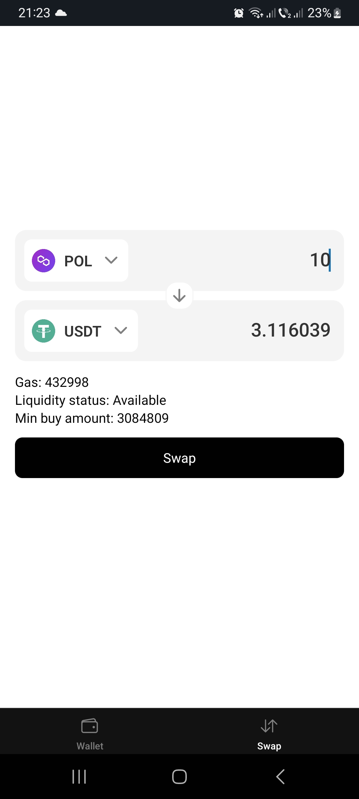
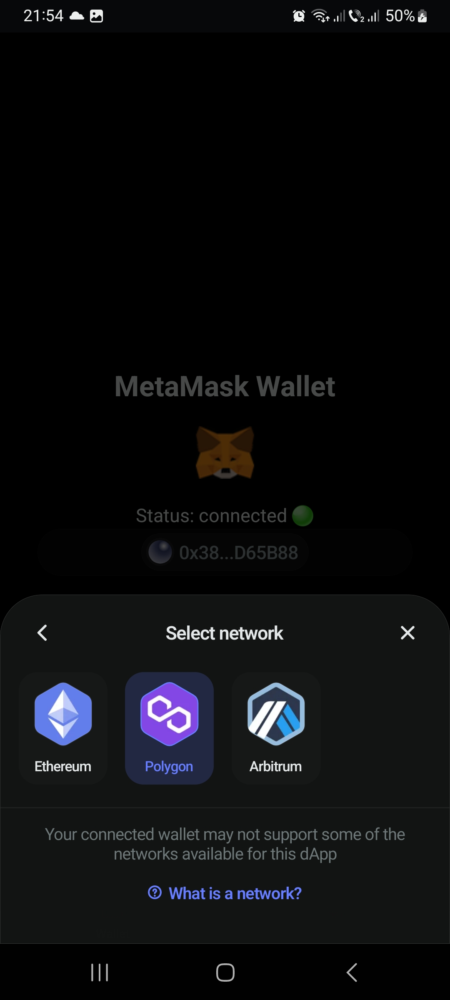
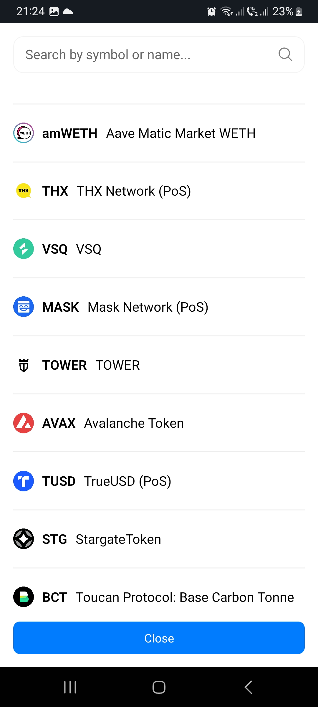
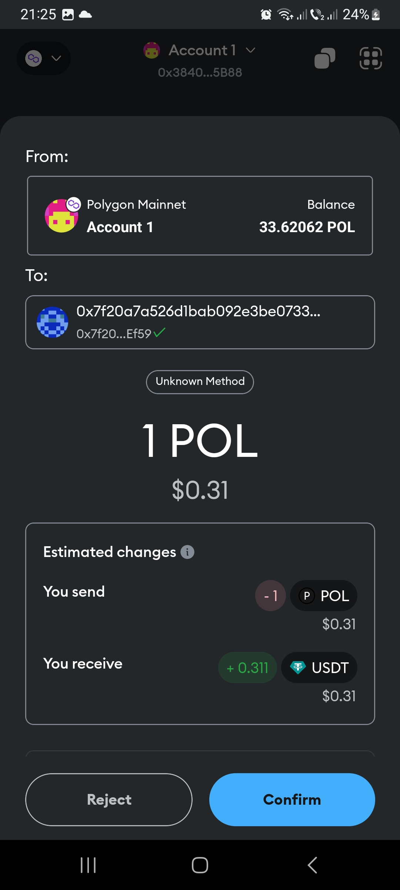
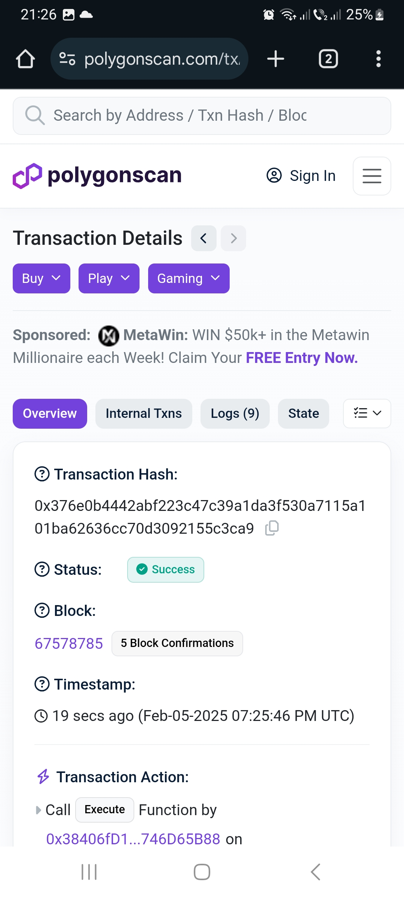

# DEX APP (React Native)

This is a fully functional Web3 exchanger, but I haven't had time yet to fully polish the UI and improve the UX. The code was written quickly and doesn’t follow best practices yet, but you can already see my skills, the logic behind it, and how it effectively gets the job done. It’s already working very fast and is quite optimized.

Swap View – You can select a token and check swap details.

Connect Wallet View – This screen shows that the MetaMask wallet is connected.

Token Selection – You can search or scroll through many tokens available on the network.

Swap Confirmation – When you press Swap, the MetaMask wallet will open, prompting you to sign and confirm the swap. Additional swap details will also be displayed.

Transaction Processing – After successfully signing and sending the transaction to the blockchain, a Check transaction button appears. This redirects to Polygonscan, where you can view the transaction status. (In a future update, all statuses will be shown in-app, with push notifications, sound, and vibration.)

Transaction Details – This is the real transaction information displayed after pressing the Check transaction button.

