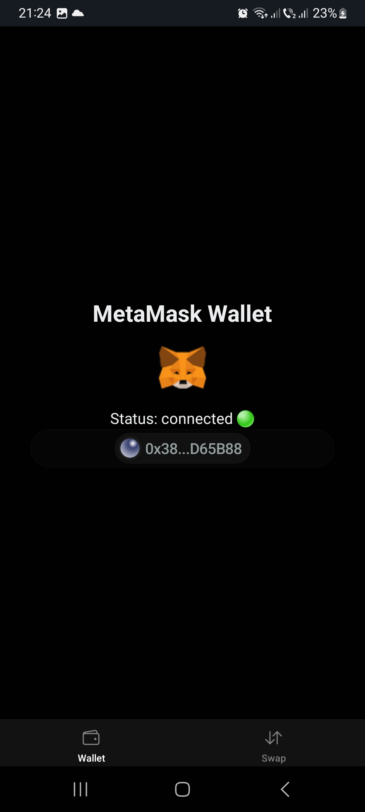
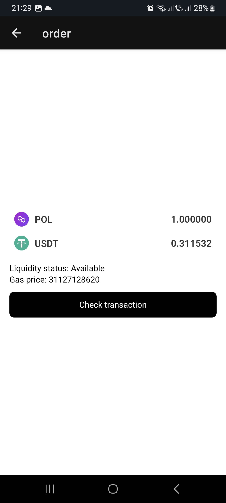

# DEX APP (React Native)

👉 Please scroll through the README file to see app screenshots showcasing each step of the swap process.

This is a fully functional Web3 exchanger, but I haven't had time yet to fully polish the UI and improve the UX. The code was written quickly and doesn’t follow best practices yet, but you can already see my skills, the logic behind it, and how it effectively gets the job done. It’s already working very fast and is quite optimized.

Connect Wallet View – This screen shows that the MetaMask wallet is connected.

You can select a network from the list. For this demo, I chose Polygon because it's inexpensive and allows me to make multiple swaps easily to test the flow.

Swap View – You can select a token and check swap details. The inputs are sanitized, and the token value is converted from BigInt to a human-readable floating-point number.

Token Selection – You can search or scroll through many tokens available on the network. This is a virtualized list, so it can handle dozens of tokens without sacrificing performance.

Swap Confirmation – Here, you can review the final prices and details before confirming the transaction. When you press Swap, the MetaMask wallet will open, prompting you to sign and confirm the swap. Additional swap details will also be displayed.

Transaction Processing – After successfully signing and sending the transaction to the blockchain, a Check transaction button appears. This redirects to Polygonscan, where you can view the transaction status. (In a future update, all statuses will be shown in-app, with push notifications, sound, and vibration.)

Transaction Details – This is the real transaction information displayed after pressing the Check transaction button.

